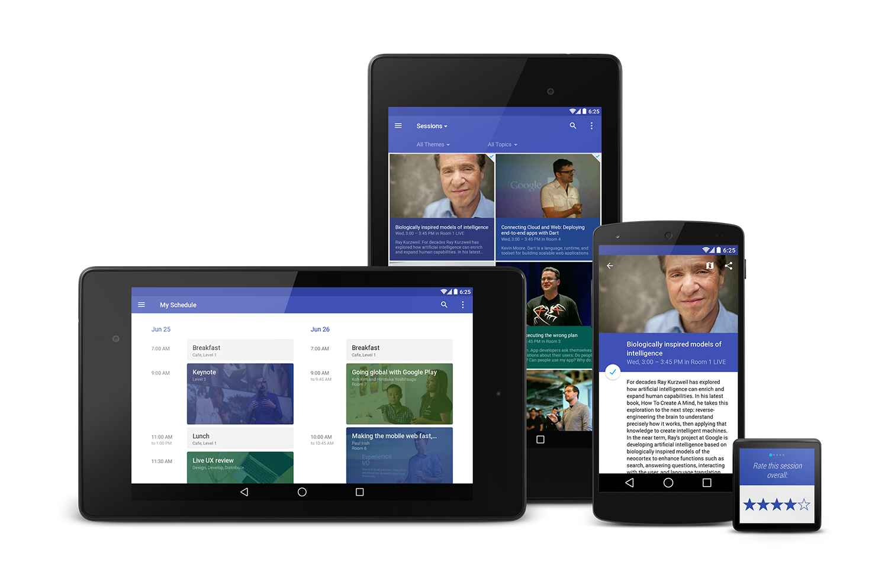

Google I/O Android App
======================

Google I/O is a developer conference held each year with two days of deep
technical content featuring technical sessions and hundreds of demonstrations
from developers showcasing their technologies.

This project is the Android app for the conference. The app supports devices
running Android 4.0+, and is optimized for phones and tablets of all shapes
and sizes. It also contains an Android Wear integration.

<h2>Android L Developer Preview</h2>

We have updated the I/O app with [material design](http://www.google.com/design/spec) and the [Android L Developer Preview](http://developer.android.com/preview/index.html)! For a quick preview of the new tactile surfaces, animated touch feedback, bold use of color, and refreshed iconography by checking out this [teaser video](https://www.youtube.com/watch?v=mCgteBXYxQc) or download the preview APK below.

<a href="../../raw/master/binaries/iosched-lpreview.apk"><b>Download the I/O app APK for Android L Preview</b></a>

To run this APK, you will need a device set up with the Android L Preview system image. For
more information, please refer to the [Android L Developer Preview page](http://developer.android.com/preview/index.html).

<h2>Source</h2>

The source code in this repository reflects the app as of I/O 2014.

<h2>Features</h2>

With the app, you can:

- View the conference agenda and edit your personal schedule
- Sync your schedule between all of your devices and the I/O website
- View detailed session, code lab, office hours, and speaker information,
  including speaker bios, photos, and Google+ profiles
- +1 sessions right from the app
- Participate in public #io14 conversations on Google+
- Guide yourself using the vector-based conference map
- Get a reminder a few minutes before sessions in your schedule are due to
  start
- View information about companies in the Developer Sandbox
- Play "I/O Live" session video streams
- Beam session details from your NFC-enabled device to another using Android Beam
- Scan attendee badges on your NFC-enabled device
- See a list of people whose badges you have scanned, and take notes about your meeting with them
- Send feedback on sessions, from your phone/tablet, or from your Android Wear device

<h2>How to Work with the Source</h2>

We hope the source code for this app is useful for you as a reference or starting point for creating your own apps. Here is some additional reading to help you better understand and reuse this code.

  * [Build instructions](doc/BUILDING.md): instructions on how to build and run the code.
  * [Sync protocol and data format](doc/SYNC.md)
  * [Image loading](doc/IMAGES.md)
  * [Use of GCM](doc/GCM.md)
  * [Customization guide](doc/CUSTOM.md)

<h2>Copyright</h2>

    Copyright 2014 Google Inc. All rights reserved.

    Licensed under the Apache License, Version 2.0 (the "License");
    you may not use this file except in compliance with the License.
    You may obtain a copy of the License at

        http://www.apache.org/licenses/LICENSE-2.0

    Unless required by applicable law or agreed to in writing, software
    distributed under the License is distributed on an "AS IS" BASIS,
    WITHOUT WARRANTIES OR CONDITIONS OF ANY KIND, either express or implied.
    See the License for the specific language governing permissions and
    limitations under the License.
