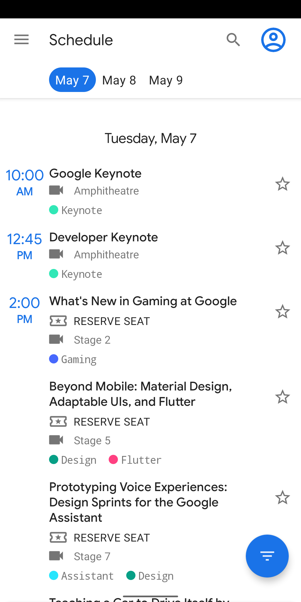

Google I/O Android App
======================

Google I/O is a developer conference held each year with three days of deep
technical content featuring technical sessions and hundreds of demonstrations
from developers showcasing their technologies.

This project is the Android app for the conference.

For a simpler fork of the app, check out the [Android Dev Summit App in the adssched branch](https://github.com/google/iosched/tree/adssched). In this variant some features are removed, such as reservations and the map screen, and Instant App support is added.

# Features

The app displays a list of conference events - sessions, office hours, app
reviews, codelabs, etc. - and allows the user to filter these events by event
types and by topics (Android, Firebase, etc.). Users can see details about
events, and they can star events that interest them. Conference attendees can
reserve events to guarantee a seat.

Other features include a Map of the venue, informational pages to
guide attendees during the conference in Info, and time-relevant information
during the conference in Home.

  

# Development Environment

The app is written entirely in Kotlin and uses the Gradle build system.

To build the app, use the `gradlew build` command or use "Import Project" in
Android Studio. A canary or stable version >= 3.4 of Android Studio is
required and may be downloaded
[here](https://developer.android.com/studio/).

# Architecture

The 2019 version of the app is built on top of the last year's app. The
architecture is built around
[Android Architecture Components](https://developer.android.com/topic/libraries/architecture/).

We followed the recommendations laid out in the
[Guide to App Architecture](https://developer.android.com/jetpack/docs/guide)
when deciding on the architecture for the app. We kept logic away from
Activities and Fragments and moved it to
[ViewModel](https://developer.android.com/topic/libraries/architecture/viewmodel)s.
We observed data using
[LiveData](https://developer.android.com/topic/libraries/architecture/livedata)
and used the [Data Binding Library](https://developer.android.com/topic/libraries/data-binding/)
to bind UI components in layouts to the app's data sources.

We used a Repository layer for handling data operations. IOSched's data comes
from a few different sources -  user data is stored in
[Cloud Firestore](https://firebase.google.com/docs/firestore/)
(either remotely or in
a local cache for offline use), user preferences and settings are stored in
SharedPreferences, conference data is stored remotely and is fetched and stored
in memory for the app to use, etc. - and the repository modules
are responsible for handling all data operations and abstracting the data sources
from the rest of the app (we liked using Firestore, but if we wanted to swap it
out for a different data source in the future, our architecture allows us to do
so in a clean way).

We implemented a lightweight domain layer, which sits between the data layer
and the presentation layer, and handles discrete pieces of business logic off
the UI thread. See the `.\*UseCase.kt` files under `shared/domain` for
[examples](https://github.com/google/iosched/search?q=UseCase&unscoped_q=UseCase).

We used [Navigation component](https://developer.android.com/guide/navigation)
to simplify into a single Activity app.

We used [Room](https://developer.android.com/jetpack/androidx/releases/room)
for Full Text Search using [Fts4](https://developer.android.com/reference/androidx/room/Fts4)
to search for a session, speaker, or codelab.

We used [Dagger2](https://github.com/google/dagger) for dependency injection
and we heavily relied on
[dagger-android](https://google.github.io/dagger/android.html) to abstract away
boiler-plate code.

We used [Espresso](https://developer.android.com/training/testing/espresso/)
for basic instrumentation tests and JUnit and
[Mockito](https://github.com/mockito/mockito) for unit testing.

## Firebase

The app makes considerable use of the following Firebase components:

-  [Cloud Firestore](https://firebase.google.com/docs/firestore/) is our source
for all user data (events starred or reserved by a user). Firestore gave us
automatic sync  and also seamlessly managed offline functionality
for us.
- [Firebase Cloud Functions](https://firebase.google.com/docs/functions/)
allowed us to run backend code. The reservations feature heavily depended on Cloud
Functions working in conjuction with Firestore.
- [Firebase Cloud Messaging](https://firebase.google.com/docs/cloud-messaging/concept-options)
let us inform the app about changes to conference data on our server.
- [Remote Config](https://firebase.google.com/docs/remote-config/) helped us
manage in-app constants.

## Kotlin

We made an early decision to rewrite the app from scratch to bring it in line
with our thinking about modern Android architecture. Using Kotlin for the
rewrite was an easy choice: we liked Kotlin's expressive, concise, and
powerful syntax; we found that Kotlin's support for safety features for
nullability and immutability made our code more resilient; and we leveraged the
enhanced functionality provided by
[Android Ktx extensions](https://developer.android.com/kotlin/ktx).

# Copyright

    Copyright 2014 Google Inc. All rights reserved.

    Licensed under the Apache License, Version 2.0 (the "License");
    you may not use this file except in compliance with the License.
    You may obtain a copy of the License at

        http://www.apache.org/licenses/LICENSE-2.0

    Unless required by applicable law or agreed to in writing, software
    distributed under the License is distributed on an "AS IS" BASIS,
    WITHOUT WARRANTIES OR CONDITIONS OF ANY KIND, either express or implied.
    See the License for the specific language governing permissions and
    limitations under the License.

