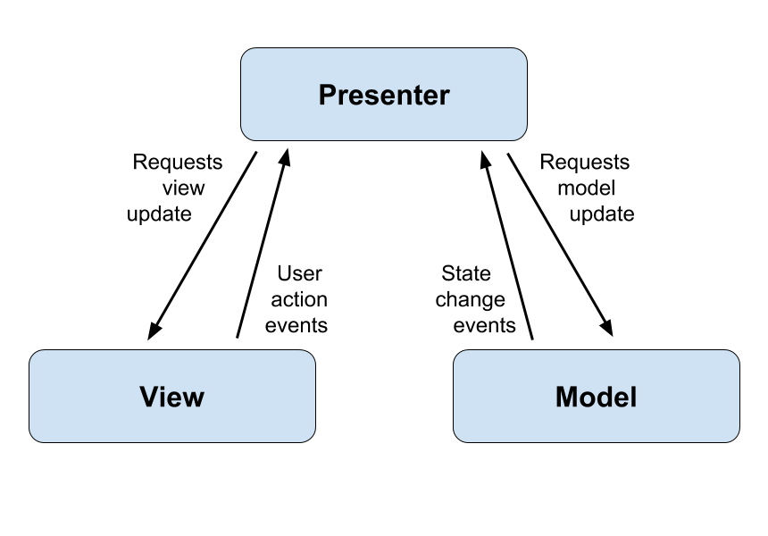
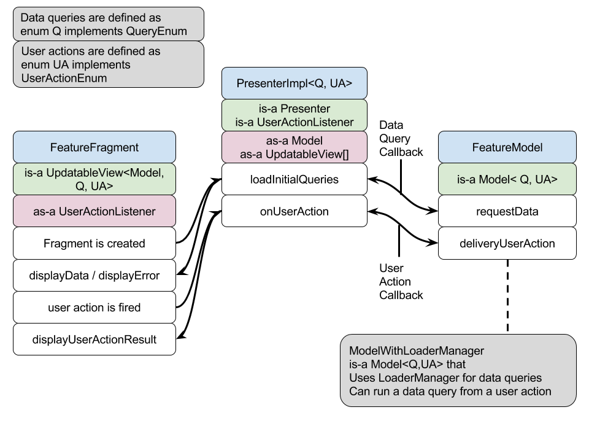

    Copyright 2016 Google Inc. All rights reserved.

    Licensed under the Apache License, Version 2.0 (the "License");
    you may not use this file except in compliance with the License.
    You may obtain a copy of the License at

        http://www.apache.org/licenses/LICENSE-2.0

    Unless required by applicable law or agreed to in writing, software
    distributed under the License is distributed on an "AS IS" BASIS,
    WITHOUT WARRANTIES OR CONDITIONS OF ANY KIND, either express or implied.
    See the License for the specific language governing permissions and
    limitations under the License.

# What is MVP?

ModelViewPresenter is a software architecture that separates concerns. The presenter acts as the 
bridge between the model and view, taking care of the presentation logic.

        
# Why MVP?

The MVP architecture improves testability, readability and scalability of the code. Those 
improvements are achieved by separating concerns: it enables easier testing (both unit and UI), 
smaller class sizes, and it makes it easier to change the way the data is obtained or the UI. 

# How we have implemented MVP

The main features of our mvp framework are:

+ **Abstraction of *DataQuery* and *UserAction* concepts**: *DataQuery* corresponds to *Requests 
model update* in the MVP diagram above, and *UserAction* corresponds to *User action events*. The 
abstraction has been done using an interface for each, [QueryEnum][QE] and [UserActionEnum][UAE].
    + A *UserAction* happens in a view, is listened to by the Presenter, and is dispatched to the 
    Model; the Model processes any data change related to the action, then, via a callback, notifies 
    the Presenter which itself notifies the view. 
    + A *DataQuery* happens when the view is loaded. The presenter is created with a list of initial
     *DataQuery*s, which are requested on the Model; the Model runs the queries, then, via a 
     callback, notifies the Presenter which itself notifies the view.

+ **Interfaces for [Model][M], [View][V] and [Presenter][P]**: those are typed using generics, so it's clear from 
the code what are all the classes integrating together to form a feature. Note: as View is a class 
in Android, the name UpdatableView is used for our mvp framework.

+ **Single implementation class for Presenter**: by using the abstraction above for *Query* and 
*UserAction*, all features can use the same implementation class for the Presenter 
([PresenterImpl][PI]), thus reducing the number of new classes required for new features. 
A PresenterImpl may have one or more Views.

+ **Abstract implementation class for Model using LoaderManager callbacks**: most of our features 
use a Content Provider and LoaderManager with a CursorLoader to get the data, so we have created 
an abstract implementation class called [ModelWithLoaderManager][MLM]. This takes care of the LoaderManager
 implementation detail. By hiding this inside the model, rather than implementing the LoaderManager
 directly on the Fragment or Activity, it means that should we decide to change this, we would need 
 only change the Model class for our features, with no change required in the Fragment 
 (UpdatableView) or Presenter.
 
+ **Framework implementation classes are unit tested**: PresenterImpl and concrete methods in 
ModelWithLoaderManager are [unit][PIT] [tested][MLMT], so individual features do not need to.

+ **Features use injection to load their model**: The [ModelProvider][MP] allows for stub models to be 
injected, thus enabling us to write deterministic UI tests. 

[QE]: ../android/src/main/java/com/google/samples/apps/iosched/archframework/QueryEnum.java
[UAE]: ../android/src/main/java/com/google/samples/apps/iosched/archframework/UserActionEnum.java
[M]: ../android/src/main/java/com/google/samples/apps/iosched/archframework/Model.java
[V]: ../android/src/main/java/com/google/samples/apps/iosched/archframework/UpdatableView.java
[P]: ../android/src/main/java/com/google/samples/apps/iosched/archframework/Presenter.java
[PI]: ../android/src/main/java/com/google/samples/apps/iosched/archframework/PresenterImpl.java
[MLM]: ../android/src/main/java/com/google/samples/apps/iosched/archframework/ModelWithLoaderManager.java
[PIT]: ../android/src/test/java/com/google/samples/apps/iosched/archframework/PresenterImplTest.java
[MLMT]: ../android/src/test/java/com/google/samples/apps/iosched/archframework/ModelWithLoaderManagerImplTest.java
[MP]: ../android/src/main/java/com/google/samples/apps/iosched/injection/ModelProvider.java

# Required coding for a new feature

+ Create a ***FeatureActivity*** class, and at least one ***FeatureFragment*** class. All 
*FeatureFragment* classes should implement [UpdatableView][V].

+ Create a ***FeatureModel*** class. Do you use LoaderManager to get the data? If yes, extend 
[ModelWithLoaderManager][MLM]. If not, implement the [Model][M] interface directly (refer to 
[MyScheduleModel][MSM] for an example).

+ Define the ***data queries*** as a public *enum* that implements [QueryEnum][QE], inside the 
*FeatureModel* class

+ Define the ***user actions*** as a public *enum* that implements [UserActionEnum][UAE], inside the 
*FeatureModel* class

+ Create an instance of the **[PresenterImpl][PI]**. Do you have multiple fragment instances in your 
activity? If yes, instantiate the *PresenterImpl* with the multiple views constructor from  your 
*FeatureActivity*, using the *FragmentManager* to get references to all your *FeatureFragment* 
instances; if not, instantiate it with the single view constructor from the *FeatureFragment* 
directly.

+ **Apply TDD for your model**: create a unit test class, write tests for each query and user 
action. The [PresenterImpl][PI] ensures that the [Model][M] cannot be called with invalid query or user
action so no need to test for those. Refer to [SessionDetailModelTest][SDMT] as an example if you need 
help to get started.

+ **Apply TDD for your view**: While unit tests are useful for complex classes and methods, the only 
way to ensure an app is maintainable is to have tests for the functionality from a user's point of view,
 ie UI tests. 
    * Create an Android test class. Refer to [ExploreIOActivityTest][EIOAT] as an example if you need 
    help to get started.
    * Create a stub model that extends your *FeatureModel* and override any mechanism that queries
    the content provider for data. Refer to [StubExploreIOModel][SEIOM] as an example.
    * Create fake data or use already created fake data (refer to classes in [mockdata package][MDP]).
     To create new fake data, you may find methods in  [OutputMockData][OMD] useful. This step is the
     most time consuming but it ensures you have deterministic UI tests (ie tests that don't rely on 
     the server data).
    * Write UI tests using the [Android Test Support Library][ATSL]. Refer to [SessionFeedbackActivityTest][AFAT]
    and [SessionDetailActivity_InScheduleSessionTest][SDAT] as an example.
    * Note that each test class will use the same stub model with the same mock data, so create 
    several test classes if you need tests for different data.

[MSM]: ../android/src/main/java/com/google/samples/apps/iosched/myschedule/MyScheduleModel.java
[SDMT]: ../android/src/test/java/com/google/samples/apps/iosched/session/SessionDetailModelTest.java
[EIOAT]: ../android/src/androidTest/java/com/google/samples/apps/iosched/explore/ExploreIOActivityTest.java
[SEIOM]: ../android/src/androidTest/java/com/google/samples/apps/iosched/explore/StubExploreIOModel.java
[MDP]: ../android/src/androidTest/java/com/google/samples/apps/iosched/mockdata/
[ATSL]: https://google.github.io/android-testing-support-library/
[OMD]: ../android/src/main/java/com/google/samples/apps/iosched/debug/OutputMockData.java
[AFAT]: ../android/src/androidTest/java/com/google/samples/apps/iosched/feedback/SessionFeedbackActivityTest.java
[SDAT]: ../android/src/androidTest/java/com/google/samples/apps/iosched/session/SessionDetailActivity_InScheduleSessionTest.java
