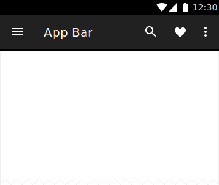

<!--docs:
title: "App Bars"
layout: detail
section: components
excerpt: "A flexible toolbar designed to provide a typical Material Design experience."
iconId: toolbar
path: /catalog/app-bar-layout/
-->

# App Bars

<!--{: .article__asset.article__asset--screenshot }-->

`AppBarLayout` is the ViewGroup used to wrap the app bar that provides many of the
Material Design features and interactions for **app bars**, namely responsiveness
to scrolling.

## Design & API Documentation

*   [Material Design guidelines: App Bars](https://material.io/guidelines/layout/structure.html#structure-app-bar)
    <!--{: .icon-list-item.icon-list-item--spec }-->
*   [Material Design guidelines: Scrolling techniques](https://material.io/guidelines/patterns/scrolling-techniques.html)
    <!--{: .icon-list-item.icon-list-item--spec }-->
*   [Class definition](https://github.com/material-components/material-components-android/tree/master/lib/src/android/support/design/widget/AppBarLayout.java)
    <!--{: .icon-list-item.icon-list-item--link }-->  <!-- Styles for list items requiring icons instead of standard bullets. -->
*   [Class overview](https://developer.android.com/reference/android/support/design/widget/AppBarLayout.html)
    <!--{: .icon-list-item.icon-list-item--link }-->
<!--{: .icon-list }-->

As a container for Toolbars, and other views, it works with
[CoordinatorLayout](CoordinatorLayout.md)
in order to respond to scrolling techniques. `AppBarLayout` depends heavily on
being used as a direct child of the CoordinatorLayout and reacts to a sibling
that supports scrolling
(e.g. [NestedScrollView](https://developer.android.com/reference/android/support/v4/widget/NestedScrollView.html),
[RecyclerView](https://developer.android.com/reference/android/support/v7/widget/RecyclerView.html)).

Flags are added to each child of the `AppBarLayout` to control how they will
respond to scrolling. These are interpreted by the `AppBarLayout.LayoutParams`.

**Available flags are:**

*   [enterAlways](https://developer.android.com/reference/android/support/design/widget/AppBarLayout.LayoutParams.html#SCROLL_FLAG_ENTER_ALWAYS)
*   [enterAlwaysCollapsed](https://developer.android.com/reference/android/support/design/widget/AppBarLayout.LayoutParams.html#SCROLL_FLAG_ENTER_ALWAYS_COLLAPSED)
*   [exitUntilCollapsed](https://developer.android.com/reference/android/support/design/widget/AppBarLayout.LayoutParams.html#SCROLL_FLAG_EXIT_UNTIL_COLLAPSED)
*   [scroll](https://developer.android.com/reference/android/support/design/widget/AppBarLayout.LayoutParams.html#SCROLL_FLAG_SCROLL)
*   [snap](https://developer.android.com/reference/android/support/design/widget/AppBarLayout.LayoutParams.html#SCROLL_FLAG_SNAP)

Views using the scroll flag should be declared and visually positioned before
other views in the `AppBarLayout`. This ensures that they are able to exit at the
top of the screen, leaving behind fixed, or pinned, elements.

## Related Concepts

The app bar is a way of referencing a specific type of *Toolbar*. It's not a
separate Android class. This UI element is often used to provide branding for
the app as well as a place to handle common actions like navigation, search, and
menus. These are accessible via text or buttons in the Toolbar. A Toolbar that
provides some of these features is often referred to as the app bar. They are
programatically identical and use the Toolbar class.

The app bar was previously termed *action bar*, and there are methods that
utilize this name (e.g. [getSupportActionBar](https://developer.android.com/reference/android/support/v7/app/AppCompatActivity.html#getSupportActionBar())).
Other than use of the action bar APIs, references to this prominent Toolbar
element should be *app bar*.

A CollapsingToolbarLayout is often used as a wrapper around the Toolbar to
provide additional UI features in relation to scrolling.

*   [App bar](https://material.io/guidelines/layout/structure.html#structure-app-bar)
*   [Toolbars](https://material.io/guidelines/components/toolbars.html#toolbars-usage)
*   [CollapsingToolbarLayout](CollapsingToolbarLayout.md)
