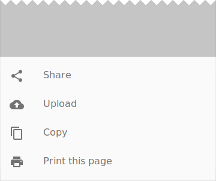

<!--docs:
title: "Bottom Sheets"
layout: detail
section: components
excerpt: "Bottom sheets slide up from the bottom of the screen to reveal more content."
iconId: bottom_sheet
path: /catalog/bottom-sheet-behavior/
-->

# Bottom Sheets


<!--{: .article__asset.article__asset--screenshot }-->

`BottomSheetBehavior` is applied to a child of
[CoordinatorLayout](CoordinatorLayout.md)
to make that child a **persistent bottom sheet**.

Persistent bottom sheets are views that come up from the bottom of the
screen, elevated over the main content. They can be dragged vertically to
expose more or less of their content.

Note: If you want to use Bottom Sheets that are modal (dialogs), use
[BottomSheetDialogFragment](BottomSheetDialogFragment.md).

## Design & API Documentation

-   [Material Design guidelines: Bottom Sheets](https://material.io/guidelines/components/bottom-sheets.html#bottom-sheets-persistent-bottom-sheets)
    <!--{: .icon-list-item.icon-list-item--spec }-->
-   [Class definition](https://github.com/material-components/material-components-android/tree/master/lib/src/android/support/design/widget/BottomSheetBehavior.java)
    <!--{: .icon-list-item.icon-list-item--link }-->
-   [Class overview](https://developer.android.com/reference/android/support/design/widget/BottomSheetBehavior.html)
    <!--{: .icon-list-item.icon-list-item--link }-->
<!--{: .icon-list }-->

## Usage

`BottomSheetBehavior` works in tandem with CoordinatorLayout to let you display
content on a Bottom sheet (a layer on top of the main content), perform
enter/exit animations, respond to dragging/swiping gestures, etc.

Bottom sheets have 5 states:

-   `STATE_COLLAPSED`: The bottom sheet is visible but only showing its peek
    height. This state is usually the 'resting position' of a Bottom Sheet. The
    peek height is chosen by the developer and should be enough to indicate
    there is extra content, allow the user to trigger an action or expand the
    bottom sheet.
-   `STATE_EXPANDED`: The bottom sheet is visible and its maximum height and it
    is neither dragging or settling (see below).
-   `STATE_DRAGGING`: The user is actively dragging the bottom sheet up or down.
-   `STATE_SETTLING`: The bottom sheet is settling to specific height after a
    drag/swipe gesture. This will be the peek height, expanded height, or
    0, in case the user action caused the bottom sheet to hide.
-   `STATE_HIDDEN`: The bottom sheet is no longer visible.

If you're already using CoordinatorLayout for your activity, adding a bottom
sheet is trivial:

1.  Add any View as a direct child of CoordinatorLayout.
2.  Apply the behavior by adding the following xml attribute
    `app:layout_behavior="android.support.design.widget.BottomSheetBehavior"`
3.  Set the desired behavior flags
    -   `app:behavior_hideable` whether this bottom sheet can be hidden by
        dragging it down.
    -   `app:behavior_peekHeight` the peek height for the collapsed state.
    -   `app:behavior_skipCollapsed` if the bottom sheet is hideable, and this
        is set to true, it does not have a collapsed state.

To programatically control the bottom sheet you can call the `setState` method
on the `BottomSheetBehavior`. A common pattern is setting a peek height and
setting the state to collapsed to make it visible to the user:

```java
bottomSheetBehavior.setPeekHeight(300);
bottomSheetBehavior.setState(BottomSheetBehavior.STATE_COLLAPSED);
```

## Related Concepts

Using [BottomSheetDialogFragment](BottomSheetDialogFragment.md) provides a
similar UI and interactions as `BottomSheetBehavior`, however
BottomSheetDialogFragment does not require CoordinatorLayout and creates a modal
bottom sheet (essentially a dialog).
