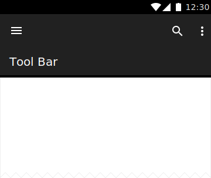

<!--docs:
title: "Collapsing Toolbars"
layout: detail
section: components
excerpt: "Collapsing toolbars change height and other visual aspects in response to scrolling."
iconId: toolbar
path: /catalog/collapsing-toolbar-layout/
-->

# Collapsing Toolbars


<!--{: .article__asset.article__asset--screenshot }-->

`CollapsingToolbarLayout` is a `ViewGroup` that provides many of the visual
characteristics and interactions for **collapsing toolbars** specified in the
material guidelines. To create the collapsing toolbar, `CollapsingToolbarLayout`
integrates with
[`AppBarLayout`](https://developer.android.com/reference/android/support/design/widget/AppBarLayout.html),
[`CoordinatorLayout`](https://developer.android.com/reference/android/support/design/widget/CoordinatorLayout.html),
[`Toolbar`](https://developer.android.com/reference/android/support/v7/widget/Toolbar.html),
and a scrollable content view, such as
[`RecyclerView`](https://developer.android.com/reference/android/support/v7/widget/RecyclerView.html).

## Design & API Documentation

*   [Material Design
    guidelines: UI regions](https://material.io/guidelines/layout/structure.html#structure-ui-regions)
    <!--{: .icon-list-item.icon-list-item--spec }-->
*   [Material Design guidelines:
    Scrolling app bar behavior](https://material.io/guidelines/patterns/scrolling-techniques.html#scrolling-techniques-behavior)
    <!--{: .icon-list-item.icon-list-item--spec }-->
*   [Class
    definition](https://github.com/material-components/material-components-android/tree/master/lib/src/android/support/design/widget/CollapsingToolbarLayout.java)
    <!--{: .icon-list-item.icon-list-item--link }-->
*   [Class
    overview](https://developer.android.com/reference/android/support/design/widget/CollapsingToolbarLayout.html)
    <!--{: .icon-list-item.icon-list-item--link }-->
<!--{: .icon-list }-->

## Usage

To add a collapsing toolbar to your layout, place the `CollapsingToolbarLayout`
inside an `AppBarLayout`. Then, add a `Toolbar` and any other views as a child
to the `CollapsingToolbarLayout`. Make sure that the entire view structure is
inside a `CoordinatorLayout` to take advantage of `CollapsingToolbarLayout`'s
scrolling and features.

A layout with a collapsing toolbar might look something like this:

```xml
<android.support.design.widget.CoordinatorLayout
    android:layout_width="match_parent"
    android:layout_height="match_parent">

    <!-- Scrollable view here -->

  <android.support.design.widget.AppBarLayout
      android:layout_width="match_parent"
      android:layout_height="@dimen/tall_toolbar_height">

    <android.support.design.widget.CollapsingToolbarLayout
        android:layout_width="match_parent"
        android:layout_height="match_parent"
        app:contentScrim="?attr/colorPrimary"
        app:expandedTitleGravity="top"
        app:layout_scrollFlags="scroll|exitUntilCollapsed|snap">

      <android.support.v7.widget.Toolbar
          android:layout_width="match_parent"
          android:layout_height="?attr/actionBarSize"
          app:layout_collapseMode="pin"/>
    </android.support.design.widget.CollapsingToolbarLayout>
  </android.support.design.widget.AppBarLayout>
</android.support.design.widget.CoordinatorLayout>
```

A common collapsing toolbar pattern is the parallax image scroll, in which
images or other children of the `CollapsingToolbarLayout` scroll at different
rates than their siblings. To achieve this effect, add an
[`ImageView`](https://developer.android.com/reference/android/widget/ImageView.html)
and any other views as children of the `CollapsingToolbarLayout`. Specify parallax
multipliers in the XML for as many of the siblings as you like.

A toolbar with a collapsing image might look something like this:

```xml
<android.support.design.widget.CollapsingToolbarLayout
    android:layout_width="match_parent"
    android:layout_height="match_parent"
    app:contentScrim="?attr/colorPrimary"
    app:expandedTitleGravity="top"
    app:expandedTitleMarginStart="@dimen/shrine_toolbar_offset_start"
    app:expandedTitleMarginTop="@dimen/shrine_toolbar_offset_top"
    app:layout_scrollFlags="scroll|exitUntilCollapsed|snap">

  <ImageView
      android:layout_width="wrap_content"
      android:layout_height="wrap_content"
      android:layout_marginTop="@dimen/shrine_toolbar_image_offset_top"
      app:layout_collapseMode="parallax"
      app:layout_collapseParallaxMultiplier="0.5"/>

  <android.support.v7.widget.Toolbar
      android:id="@+id/AppBar"
      android:layout_width="match_parent"
      android:layout_height="@dimen/shrine_toolbar_collapsed_height"
      app:layout_collapseMode="pin"/>
</android.support.design.widget.CollapsingToolbarLayout>
```

You can combine the basic collapsing toolbar with scroll flags,
`CollapsingToolbarLayout`'s attributes, `TabViewLayout`, or any other view you
would like to achieve your desired toolbar.

*   Make sure to call
    [`setTitle()`](https://developer.android.com/reference/android/support/design/widget/CollapsingToolbarLayout.html#setTitle\(java.lang.CharSequence\))
    on the `CollapsingToolbarLayout` instead of the `Toolbar`. This allows
    `CollapsingToolbarLayout` the ability to resize the title based on the
    toolbar's current size.
*   You can add as many views as you like to the `CollapsingToolbarLayout`, but
    make sure that the `Toolbar` is the last child of the
    `CollapsingToolbarLayout`. This ensures that the views are drawn in the
    correct order.
*   The scrolling content should be placed in a
    [`RecyclerView`](https://developer.android.com/reference/android/support/v7/widget/RecyclerView.html),
    [`NestedScrollView`](https://developer.android.com/reference/android/support/v4/widget/NestedScrollView.html),
    or another view that supports nested scrolling.

## Related Concepts

*   [AppBarLayout](https://developer.android.com/reference/android/support/design/widget/AppBarLayout.html)
*   [TabLayout](https://developer.android.com/reference/android/support/design/widget/TabLayout.html)
