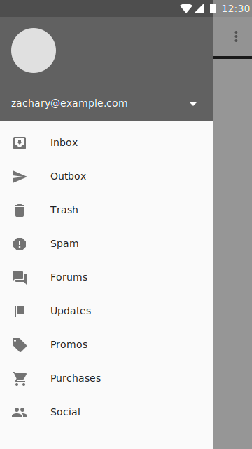

<!--docs:
title: "Navigation Views"
layout: detail
section: components
excerpt: "A scrollable view that renders a menu resource as a vertical list."
iconId: side_navigation
path: /catalog/navigation-view/
-->

# Navigation Views


<!--{: .article__asset.article__asset--screenshot }-->

`NavigationView` is an easy way to display a navigation menu from a menu
resource.

This is most commonly used in conjunction with
[`DrawerLayout`](https://developer.android.com/reference/android/support/v4/widget/DrawerLayout.html)
to implement [Material navigation
drawers](https://material.io/guidelines/patterns/navigation-drawer.html#).
Navigation drawers are modal elevated dialogs that come from the start/left
side, used to display in-app navigation links.

## Design & API Documentation

-   [Class definition](https://github.com/material-components/material-components-android/tree/master/lib/src/android/support/design/widget/NavigationView.java)
    <!--{: .icon-list-item.icon-list-item--link }-->
-   [Class overview](https://developer.android.com/reference/android/support/design/widget/NavigationView.html)
    <!--{: .icon-list-item.icon-list-item--link }-->
<!--{: .icon-list }-->

## Usage

`NavigationView` is a scrollable view that renders a menu resource
(`R.menu.<something>`) as a vertical list. It also renders a header view above
the menu.

```xml
<android.support.design.widget.NavigationView
  android:id="@+id/navigation"
  android:layout_width="wrap_content"
  android:layout_height="match_parent"
  android:layout_gravity="start|left"
  app:headerLayout="@layout/navigation_header"
  app:menu="@menu/my_navigation_items" />
```

### Available flags

*   `app:menu` points to a menu resource that will be rendered by
    `NavigationView`
*   `app:headerLayout` points to a layout resource to use as a header for the
    `NavigationView`

### Handling selection

You can use `setNavigationItemSelectedListener` to listen to item selection and
implement your navigation logic.

### Header views

You can add one header in the XML layout, but you can add multiple header views
programatically with `addHeaderView(View)` (even if you already added one in the
XML layout). You can use `getHeaderView(int)` to get any of the header views at
runtime.

If you need to access the header view you added in the XML layout, that will
always be the first header view, so you can get it with `getHeaderView(0)`.

### Implementing Material navigation drawers

Implementing navigation drawers is the most common use for `NavigationView`,
this section guides you on how to use `NavigationView` in that context.

1.  Wrap your activity's content in a `DrawerLayout`. *In the example below, the
activity's content is the CoordinatorLayout*
2.  Keep your main content as the first child of that `DrawerLayout`.
3.  Add your `NavigationView` with `android:layout_gravity="start|left"` and
    `android:height="match_parent"`

Assuming your Activity's content is in a CoordinatorLayout you may have something like
this:

```xml
<android.support.v4.widget.DrawerLayout>
  <android.support.design.widget.CoordinatorLayout>
    <!-- Your content goes here -->
  </android.support.design.widget.CoordinatorLayout>

  <android.support.design.widget.NavigationView
    android:id="@+id/navigation"
    android:layout_width="wrap_content"
    android:layout_height="match_parent"
    android:layout_gravity="start|left"
    app:headerLayout="@layout/navigation_header"
    app:menu="@menu/my_navigation_items" />
</android.support.v4.widget.DrawerLayout>
```

## Related Concepts

There are other navigation patterns you should be aware of

-   [Hierarchical navigation](https://developer.android.com/training/implementing-navigation/index.html).
    *See also [Navigation with Back and
    Up](https://developer.android.com/design/patterns/navigation.html)*
-   Swipeable tabs using [TabLayout](TabLayout.md) and
    [ViewPager](https://developer.android.com/reference/android/support/v4/view/ViewPager.html)
-   [BottomNavigationView](BottomNavigationView.md) for when you have only 3 to
    5 very well defined navigation categories

You should familiarize yourself with the most common use for `NavigationView`,
[Creating a Navigation Drawer -
Guide](https://developer.android.com/training/implementing-navigation/nav-drawer.html)
