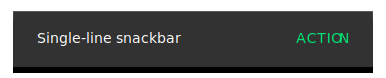

<!--docs:
title: "Snackbars"
layout: detail
section: components
excerpt: "Brief feedback for an action through a message at the bottom of the screen."
iconId: toast
path: /catalog/snackbar/
-->

# Snackbars


<!--{: .article__asset.article__asset--screenshot }-->

The `Snackbar` widget provides brief feedback about an operation through a
message at the bottom of the screen. **Snackbars** disappear automatically,
either after a timeout or after a user interaction elsewhere on the screen,
and can also be swiped off the screen.

Snackbars can also offer the ability to perform an action, such as undoing an
action that was just taken, or retrying an action that had failed.

## Design & API Documentation

- [Material Design guidelines: Snackbars](https://material.io/guidelines/components/snackbars-toasts.html)
  <!--{: .icon-list-item.icon-list-item--spec }-->
- [Class
  definition](https://github.com/material-components/material-components-android/tree/master/lib/src/android/support/design/widget/Snackbar.java)
  <!--{: .icon-list-item.icon-list-item--link }-->
- [Class
  overview](https://developer.android.com/reference/android/support/design/widget/Snackbar.html)
  <!--{: .icon-list-item.icon-list-item--link }-->
<!--{: .icon-list }-->

## Usage

The `Snackbar` class provides static `make` methods to produce a snackbar
configured in the desired way. These methods take a `View`, which will be used
to find a suitable ancestor `ViewGroup` to display the snackbar in, a text
string to display (either as a `CharSequence` or a resource ID), and a duration
to display the snackbar for (either a duration preset, or a time in
milliseconds). A suitable ancestor `ViewGroup` will be either the nearest
`CoordinatorLayout` to the `View` passed in, or the root `DecorView` if none
could be found.

**Available duration presets are:**

- [LENGTH_INDEFINITE](https://developer.android.com/reference/android/support/design/widget/Snackbar.html#LENGTH_INDEFINITE)
- [LENGTH_LONG](https://developer.android.com/reference/android/support/design/widget/Snackbar.html#LENGTH_LONG)
- [LENGTH_SHORT](https://developer.android.com/reference/android/support/design/widget/Snackbar.html#LENGTH_SHORT)

**NOTE:** Snackbars work best if they are displayed inside of a
[CoordinatorLayout](CoordinatorLayout.md).
`CoordinatorLayout` allows the snackbar to enable behavior like
swipe-to-dismiss, as well as automatically moving widgets like
[FloatingActionButton](FloatingActionButton.md).

Calling `make` only *creates* the snackbar, it doesn't actually cause it to
be visible on the screen. For showing the snackbar, use the `show` method on the
returned `Snackbar` instance. Note that only one snackbar will be shown at a time.
Showing a new snackbar will dismiss any previous ones first.

Showing a snackbar with just a message and no action would look like this:

```java
// The view used to make the snackbar. This should be contained within the view
// hierarchy you want to display the snackbar. Generally it can be the view that
// was interacted with to trigger the snackbar, such as a button that was
// clicked, or a card that was swiped.
View contextView = findViewById(R.id.context_view);

Snackbar.make(contextView, R.string.item_removed_message, Snackbar.LENGTH_SHORT)
    .show();
```

### Adding an action

To add an action, use the `setAction` method on the object returned from `make`.
Actions require both text to display, and an `OnClickListener` to handle clicks
on the action. Snackbars are automatically dismissed when the action is clicked.

Showing a snackbar with a message and an action would look like this:

```java
Snackbar.make(contextView, R.string.item_removed_message, Snackbar.LENGTH_LONG)
    .setAction(R.string.undo, new OnClickListener() {
      @Override
      public void onClick(View v) {
        // Respond to the click, such as by undoing the modification that caused
        // this message to be displayed
      })
    });
```

Action text color can be customized through the `setActionTextColor` methods
(defaulting to your theme's accent color).

### Related concepts

Temporary bottom bars with other sorts of content layouts can be implemented by
subclassing
[BaseTransientBottomBar](https://developer.android.com/reference/android/support/design/widget/BaseTransientBottomBar.html).

Android also provides a
[Toast](https://developer.android.com/reference/android/widget/Toast.html) class
with a similar API that can be used for displaying system-level notifications.
Generally, snackbars are the preferred mechanism for displaying feedback
messages to users, as they can be displayed in the context of the UI where the
action occurred. Reserve `Toast` for cases where this cannot be done.
